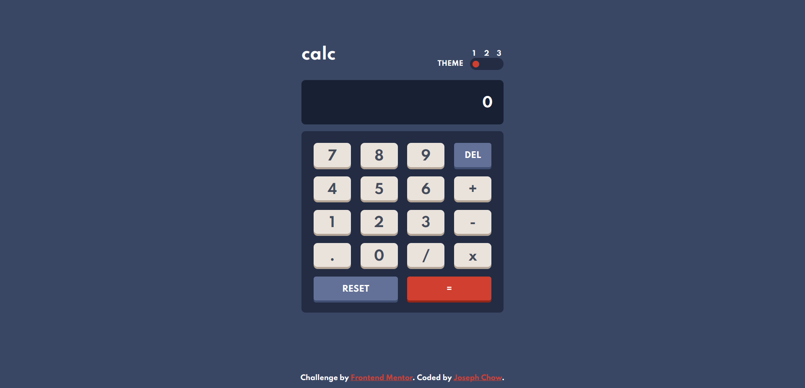
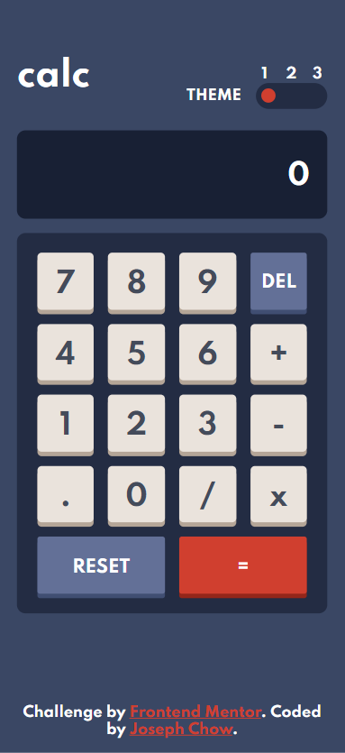

# Frontend Mentor - Calculator app solution

This is a solution to the [Calculator app challenge on Frontend Mentor](https://www.frontendmentor.io/challenges/calculator-app-9lteq5N29). Frontend Mentor challenges help you improve your coding skills by building realistic projects.

## Table of contents

- [Overview](#overview)
  - [The challenge](#the-challenge)
  - [Screenshot](#screenshot)
  - [Links](#links)
- [My process](#my-process)
  - [Built with](#built-with)
  - [What I learned](#what-i-learned)
  - [Continued development](#continued-development)
  - [Useful resources](#useful-resources)
- [Author](#author)
- [Acknowledgments](#acknowledgments)

## Overview

### The challenge

Users should be able to:

- See the size of the elements adjust based on their device's screen size
- Perform mathmatical operations like addition, subtraction, multiplication, and division
- Adjust the color theme based on their preference
- **Bonus**: Have their initial theme preference checked using `prefers-color-scheme` and have any additional changes saved in the browser

### Screenshot





### Links

- Solution URL: [https://github.com/chowjiaming/calculator-app-react](https://github.com/chowjiaming/calculator-app-react)
- Live Site URL: [https://frontend-mentor-calculator-app-chowjiaming.netlify.app/](https://frontend-mentor-calculator-app-chowjiaming.netlify.app/)

## My process

### Built with

- Semantic HTML5 markup
- CSS custom properties
- Flexbox
- CSS Grid
- Mobile-first workflow
- [React](https://reactjs.org/) - JS library

### What I learned

I originally set the footer with the attribution to position: absolute; bottom: 0; right: 50%; to stick it to the bottom. But I found on smaller screen sizes, the content would overlap because it was not in the normal document flow and the app container was set to min-height: 100vh;. Instead, I set the app container flex-direction: column; and the main element flex: 1 1 auto; to stretch out the height of the content and push the footer to the bottom of the page.

```css
.App {
  background-color: var(--main-background);
  transition: all 0.5s;
  font-family: "Spartan", sans-serif;
  font-size: 32px;
  padding: 0.5em;
  min-height: 100vh;
  display: flex;
  flex-direction: column;
  justify-content: center;
  align-items: center;
}

main {
  flex: 1 1 auto;
  display: flex;
  flex-direction: column;
  justify-content: center;
}
```

### Continued development

I think it would be cool if the calculator included scientific notation in desktop or mobile landscape breakpoint and simple notation in mobile portrait.

## Author

- Website - [Joseph Chow](https://josephchow.dev/)
- Frontend Mentor - [@chowjiaming](https://www.frontendmentor.io/profile/chowjiaming)
- Twitter - [@couri3r](https://www.twitter.com/couri3r)
